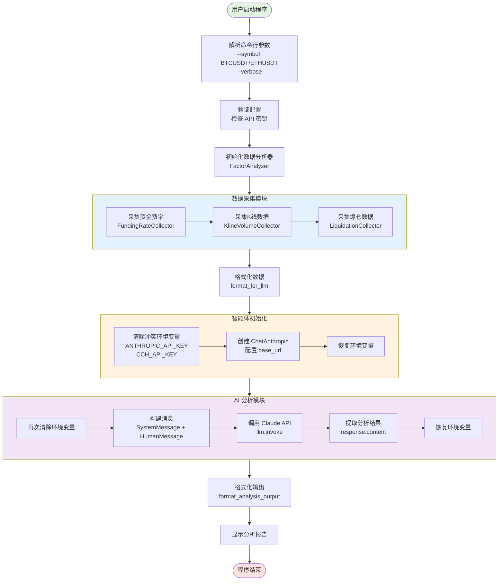
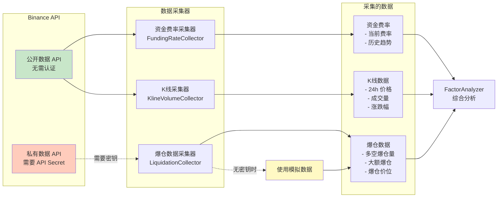
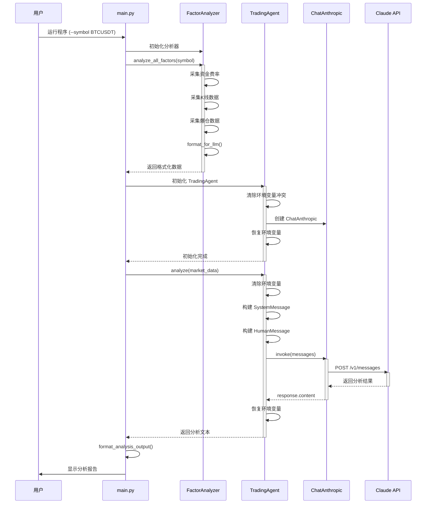
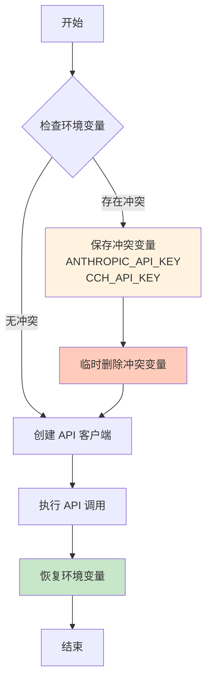
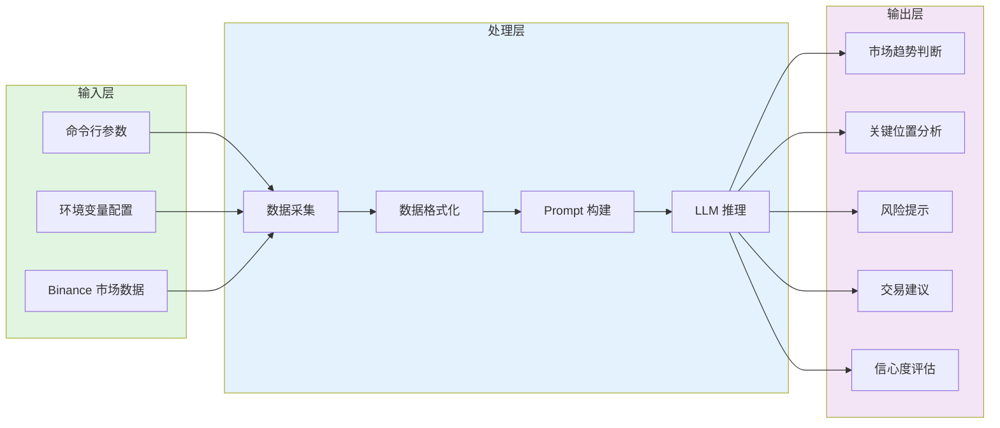
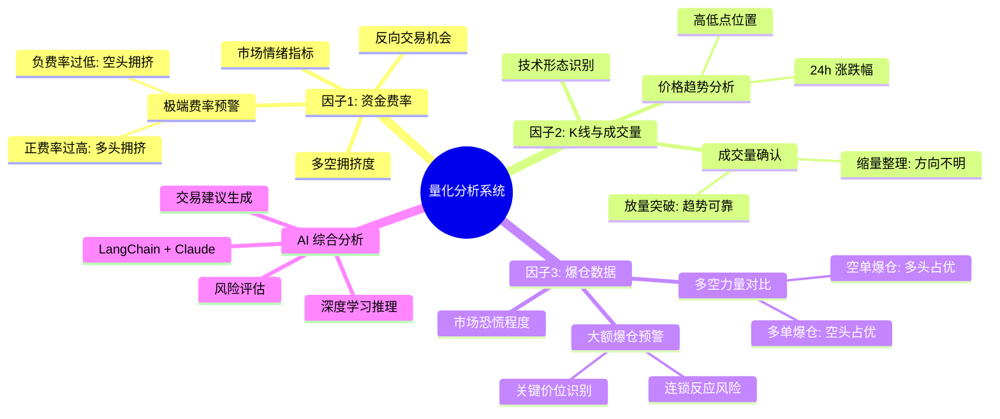
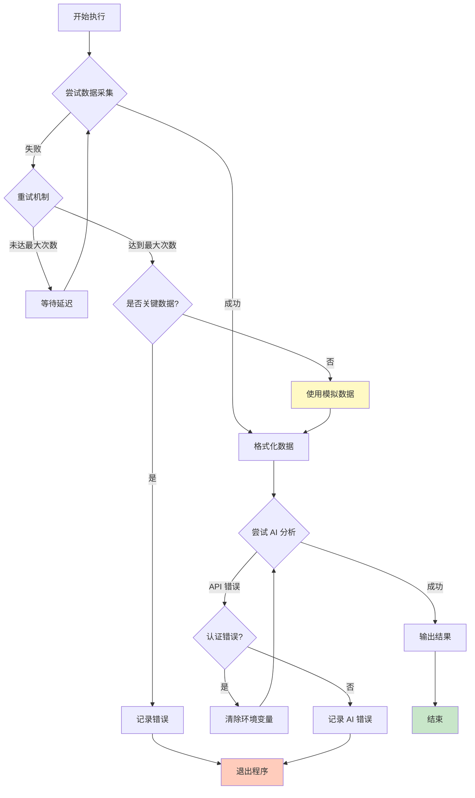

# 交易智能体系统流程图

## 系统架构流程图

```mermaid
graph TB
    Start([用户启动程序]) --> ParseArgs[解析命令行参数<br/>--symbol BTCUSDT/ETHUSDT<br/>--verbose]
    ParseArgs --> ValidateConfig[验证配置<br/>检查 API 密钥]
    ValidateConfig --> InitAnalyzer[初始化数据分析器<br/>FactorAnalyzer]

    InitAnalyzer --> DataCollection[数据采集阶段]

    subgraph DataCollection [数据采集模块]
        DC1[采集资金费率<br/>FundingRateCollector] --> DC2[采集K线数据<br/>KlineVolumeCollector]
        DC2 --> DC3[采集爆仓数据<br/>LiquidationCollector]
    end

    DataCollection --> FormatData[格式化数据<br/>format_for_llm]
    FormatData --> InitAgent[初始化交易智能体<br/>TradingAgent]

    subgraph InitAgent [智能体初始化]
        IA1[清除冲突环境变量<br/>ANTHROPIC_API_KEY<br/>CCH_API_KEY] --> IA2[创建 ChatAnthropic<br/>配置 base_url]
        IA2 --> IA3[恢复环境变量]
    end

    InitAgent --> AIAnalysis[AI 分析阶段]

    subgraph AIAnalysis [AI 分析模块]
        AA1[再次清除环境变量] --> AA2[构建消息<br/>SystemMessage + HumanMessage]
        AA2 --> AA3[调用 Claude API<br/>llm.invoke]
        AA3 --> AA4[提取分析结果<br/>response.content]
        AA4 --> AA5[恢复环境变量]
    end

    AIAnalysis --> FormatOutput[格式化输出<br/>format_analysis_output]
    FormatOutput --> DisplayResult[显示分析报告]
    DisplayResult --> End([程序结束])

    style Start fill:#e1f5e1
    style End fill:#ffe1e1
    style DataCollection fill:#e3f2fd
    style InitAgent fill:#fff3e0
    style AIAnalysis fill:#f3e5f5
```

## 数据采集详细流程

```mermaid
graph LR
    subgraph Binance [Binance API]
        B1[公开数据 API<br/>无需认证]
        B2[私有数据 API<br/>需要 API Secret]
    end

    subgraph Collectors [数据采集器]
        C1[资金费率采集器<br/>FundingRateCollector]
        C2[K线采集器<br/>KlineVolumeCollector]
        C3[爆仓数据采集器<br/>LiquidationCollector]
    end

    subgraph Data [采集的数据]
        D1[资金费率<br/>- 当前费率<br/>- 历史趋势]
        D2[K线数据<br/>- 24h 价格<br/>- 成交量<br/>- 涨跌幅]
        D3[爆仓数据<br/>- 多空爆仓量<br/>- 大额爆仓<br/>- 爆仓价位]
    end

    B1 --> C1
    B1 --> C2
    B2 -.需要密钥.-> C3
    C3 -.无密钥时.-> MockData[使用模拟数据]

    C1 --> D1
    C2 --> D2
    C3 --> D3
    MockData --> D3

    D1 --> Analyzer[FactorAnalyzer<br/>综合分析]
    D2 --> Analyzer
    D3 --> Analyzer

    style B1 fill:#c8e6c9
    style B2 fill:#ffccbc
    style MockData fill:#fff9c4
```

## AI 分析流程

```mermaid
sequenceDiagram
    participant User as 用户
    participant Main as main.py
    participant Analyzer as FactorAnalyzer
    participant Agent as TradingAgent
    participant LangChain as ChatAnthropic
    participant API as Claude API

    User->>Main: 运行程序 (--symbol BTCUSDT)
    Main->>Analyzer: 初始化分析器
    Main->>Analyzer: analyze_all_factors(symbol)

    activate Analyzer
    Analyzer->>Analyzer: 采集资金费率
    Analyzer->>Analyzer: 采集K线数据
    Analyzer->>Analyzer: 采集爆仓数据
    Analyzer->>Analyzer: format_for_llm()
    Analyzer-->>Main: 返回格式化数据
    deactivate Analyzer

    Main->>Agent: 初始化 TradingAgent
    activate Agent
    Agent->>Agent: 清除环境变量冲突
    Agent->>LangChain: 创建 ChatAnthropic
    Agent->>Agent: 恢复环境变量
    Agent-->>Main: 初始化完成
    deactivate Agent

    Main->>Agent: analyze(market_data)
    activate Agent
    Agent->>Agent: 清除环境变量
    Agent->>Agent: 构建 SystemMessage
    Agent->>Agent: 构建 HumanMessage
    Agent->>LangChain: invoke(messages)

    activate LangChain
    LangChain->>API: POST /v1/messages
    activate API
    API-->>LangChain: 返回分析结果
    deactivate API
    LangChain-->>Agent: response.content
    deactivate LangChain

    Agent->>Agent: 恢复环境变量
    Agent-->>Main: 返回分析文本
    deactivate Agent

    Main->>Main: format_analysis_output()
    Main->>User: 显示分析报告
```

## 环境变量冲突处理机制

```mermaid
graph TD
    Start[开始] --> CheckEnv{检查环境变量}
    CheckEnv -->|存在冲突| SaveVars[保存冲突变量<br/>ANTHROPIC_API_KEY<br/>CCH_API_KEY]
    CheckEnv -->|无冲突| CreateClient[创建 API 客户端]

    SaveVars --> RemoveVars[临时删除冲突变量]
    RemoveVars --> CreateClient

    CreateClient --> APICall[执行 API 调用]
    APICall --> RestoreVars[恢复环境变量]
    RestoreVars --> End[结束]

    style SaveVars fill:#fff3e0
    style RemoveVars fill:#ffccbc
    style RestoreVars fill:#c8e6c9
```

## 数据流转图

```mermaid
graph LR
    subgraph Input [输入层]
        I1[命令行参数]
        I2[环境变量配置]
        I3[Binance 市场数据]
    end

    subgraph Processing [处理层]
        P1[数据采集]
        P2[数据格式化]
        P3[Prompt 构建]
        P4[LLM 推理]
    end

    subgraph Output [输出层]
        O1[市场趋势判断]
        O2[关键位置分析]
        O3[风险提示]
        O4[交易建议]
        O5[信心度评估]
    end

    I1 --> P1
    I2 --> P1
    I3 --> P1

    P1 --> P2
    P2 --> P3
    P3 --> P4

    P4 --> O1
    P4 --> O2
    P4 --> O3
    P4 --> O4
    P4 --> O5

    style Input fill:#e1f5e1
    style Processing fill:#e3f2fd
    style Output fill:#f3e5f5
```

## 三大核心因子分析

```mermaid
mindmap
  root((量化分析系统))
    因子1: 资金费率
      市场情绪指标
      多空拥挤度
      极端费率预警
        正费率过高: 多头拥挤
        负费率过低: 空头拥挤
      反向交易机会
    因子2: K线与成交量
      价格趋势分析
        24h 涨跌幅
        高低点位置
      成交量确认
        放量突破: 趋势可靠
        缩量整理: 方向不明
      技术形态识别
    因子3: 爆仓数据
      市场恐慌程度
      多空力量对比
        多单爆仓: 空头占优
        空单爆仓: 多头占优
      大额爆仓预警
        连锁反应风险
        关键价位识别
    AI 综合分析
      LangChain + Claude
      深度学习推理
      风险评估
      交易建议生成
```

## 错误处理流程

```mermaid
graph TD
    Start[开始执行] --> TryCollect{尝试数据采集}
    TryCollect -->|成功| FormatData[格式化数据]
    TryCollect -->|失败| RetryLogic{重试机制}

    RetryLogic -->|未达最大次数| Wait[等待延迟]
    Wait --> TryCollect
    RetryLogic -->|达到最大次数| CheckCritical{是否关键数据?}

    CheckCritical -->|是| LogError[记录错误]
    CheckCritical -->|否| UseMock[使用模拟数据]
    LogError --> Exit[退出程序]
    UseMock --> FormatData

    FormatData --> TryAI{尝试 AI 分析}
    TryAI -->|成功| Output[输出结果]
    TryAI -->|API 错误| CheckAuth{认证错误?}

    CheckAuth -->|是| ClearEnv[清除环境变量]
    CheckAuth -->|否| LogAIError[记录 AI 错误]
    ClearEnv --> TryAI
    LogAIError --> Exit

    Output --> End[结束]

    style Exit fill:#ffccbc
    style End fill:#c8e6c9
    style UseMock fill:#fff9c4
```
