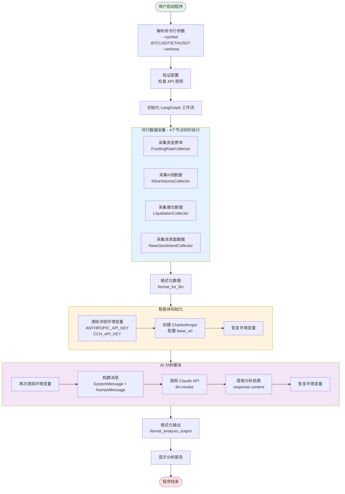
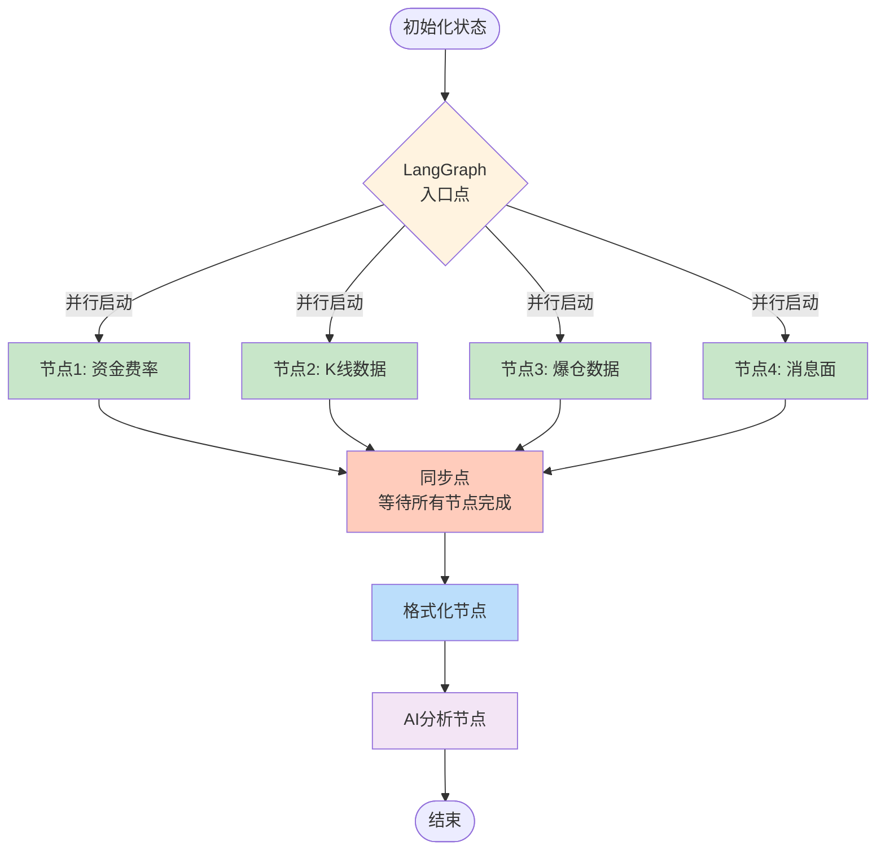
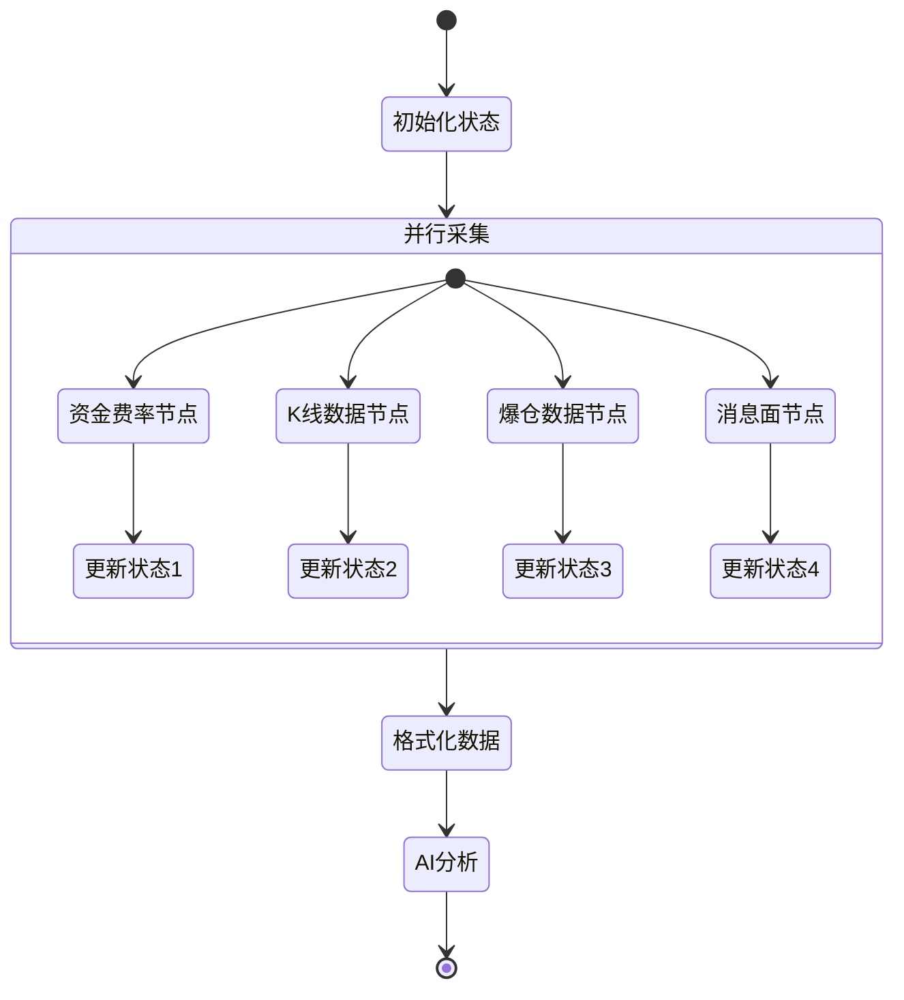
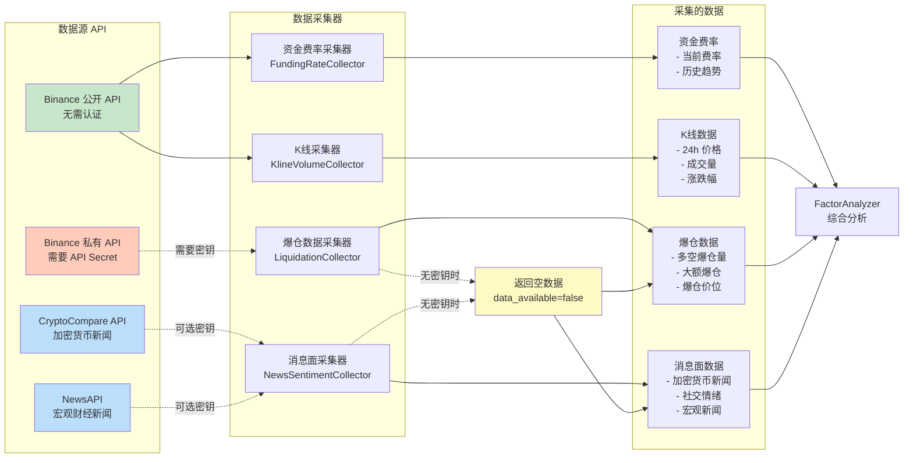
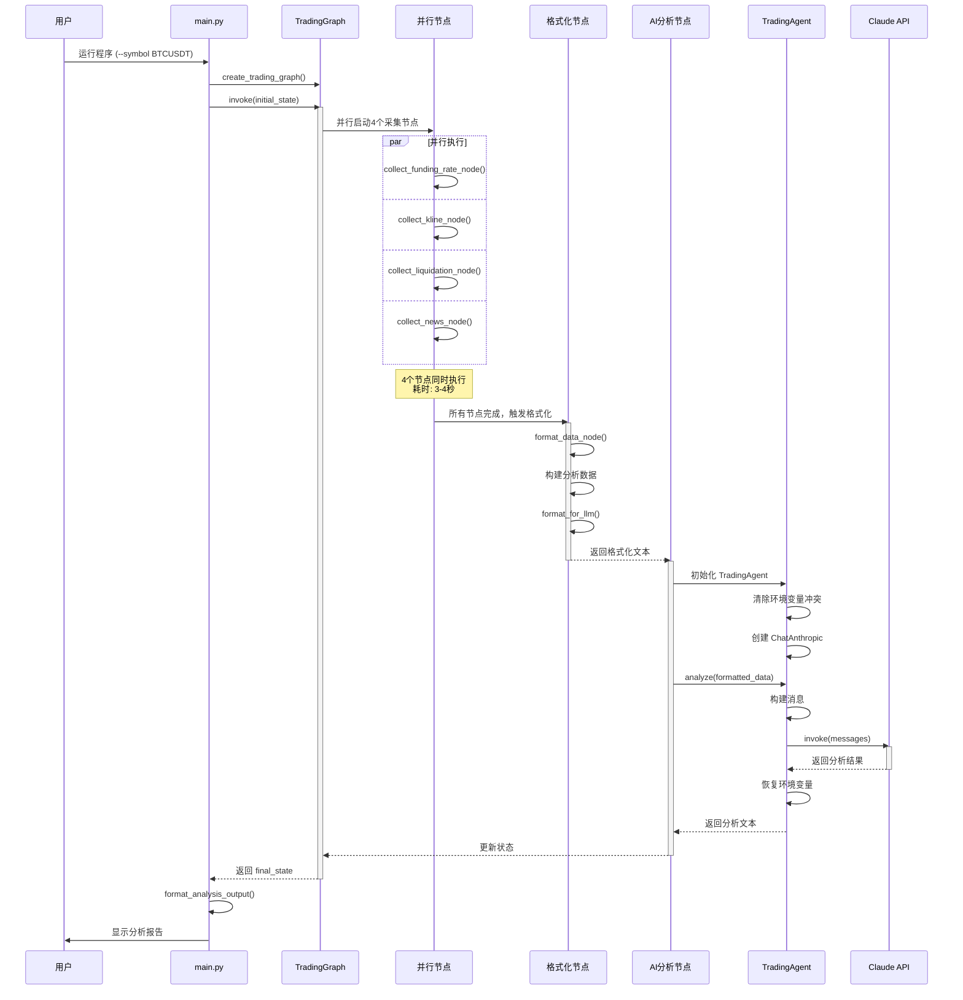
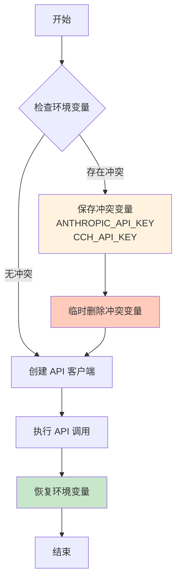
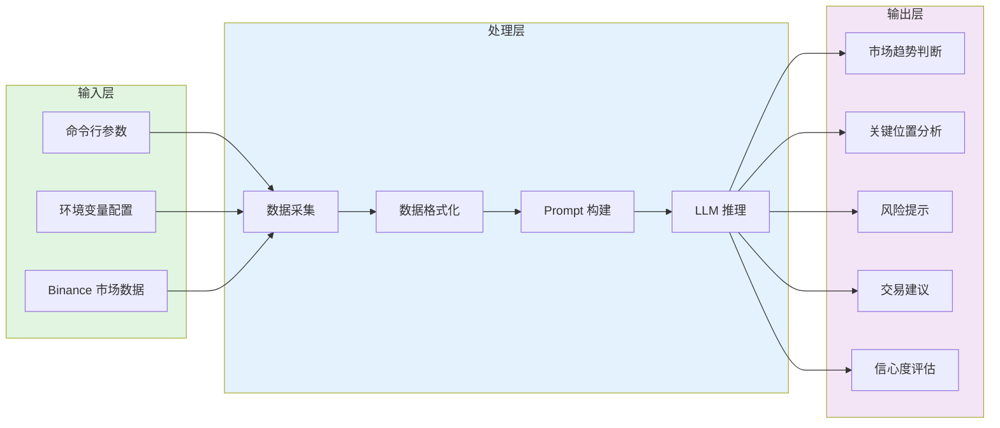
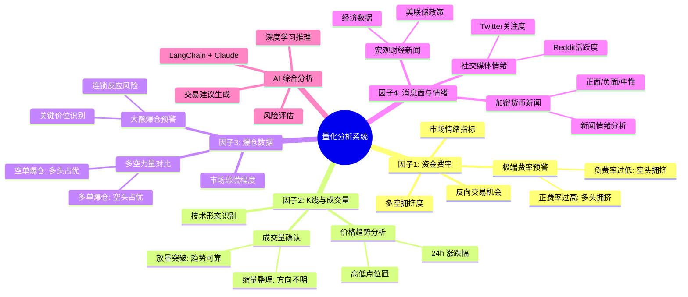
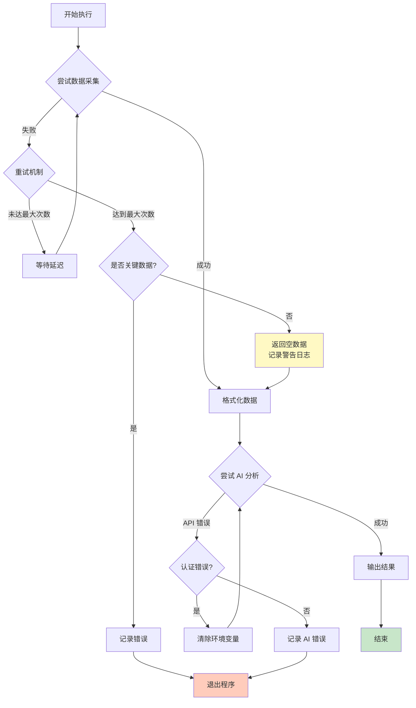

# 交易智能体系统流程图 (LangGraph版本)

## 系统架构流程图

```mermaid
graph TB
    Start([用户启动程序]) --> ParseArgs[解析命令行参数<br/>--symbol BTCUSDT/ETHUSDT<br/>--verbose]
    ParseArgs --> ValidateConfig[验证配置<br/>检查 API 密钥]
    ValidateConfig --> InitWorkflow[初始化 LangGraph 工作流]

    InitWorkflow --> ParallelCollection[并行数据采集阶段]

    subgraph ParallelCollection [并行数据采集 - 4个节点同时执行]
        DC1[采集资金费率<br/>FundingRateCollector]
        DC2[采集K线数据<br/>KlineVolumeCollector]
        DC3[采集爆仓数据<br/>LiquidationCollector]
        DC4[采集消息面数据<br/>NewsSentimentCollector]
    end

    ParallelCollection --> FormatData[格式化数据<br/>format_for_llm]
    FormatData --> InitAgent[初始化交易智能体<br/>TradingAgent]

    subgraph InitAgent [智能体初始化]
        IA1[清除冲突环境变量<br/>ANTHROPIC_API_KEY<br/>CCH_API_KEY] --> IA2[创建 ChatAnthropic<br/>配置 base_url]
        IA2 --> IA3[恢复环境变量]
    end

    InitAgent --> AIAnalysis[AI 分析阶段]

    subgraph AIAnalysis [AI 分析模块]
        AA1[再次清除环境变量] --> AA2[构建消息<br/>SystemMessage + HumanMessage]
        AA2 --> AA3[调用 Claude API<br/>llm.invoke]
        AA3 --> AA4[提取分析结果<br/>response.content]
        AA4 --> AA5[恢复环境变量]
    end

    AIAnalysis --> FormatOutput[格式化输出<br/>format_analysis_output]
    FormatOutput --> DisplayResult[显示分析报告]
    DisplayResult --> End([程序结束])

    style Start fill:#e1f5e1
    style End fill:#ffe1e1
    style ParallelCollection fill:#e3f2fd
    style InitAgent fill:#fff3e0
    style AIAnalysis fill:#f3e5f5
```

## LangGraph 并行执行流程

```mermaid
graph TB
    Start([初始化状态]) --> Entry{LangGraph<br/>入口点}

    Entry -->|并行启动| Node1[节点1: 资金费率]
    Entry -->|并行启动| Node2[节点2: K线数据]
    Entry -->|并行启动| Node3[节点3: 爆仓数据]
    Entry -->|并行启动| Node4[节点4: 消息面]

    Node1 --> Sync[同步点<br/>等待所有节点完成]
    Node2 --> Sync
    Node3 --> Sync
    Node4 --> Sync

    Sync --> Format[格式化节点]
    Format --> AI[AI分析节点]
    AI --> End([结束])

    style Entry fill:#fff3e0
    style Node1 fill:#c8e6c9
    style Node2 fill:#c8e6c9
    style Node3 fill:#c8e6c9
    style Node4 fill:#c8e6c9
    style Sync fill:#ffccbc
    style Format fill:#bbdefb
    style AI fill:#f3e5f5
```

## 状态管理流程

```mermaid
stateDiagram-v2
    [*] --> 初始化状态
    初始化状态 --> 并行采集

    state 并行采集 {
        [*] --> 资金费率节点
        [*] --> K线数据节点
        [*] --> 爆仓数据节点
        [*] --> 消息面节点

        资金费率节点 --> 更新状态1
        K线数据节点 --> 更新状态2
        爆仓数据节点 --> 更新状态3
        消息面节点 --> 更新状态4
    }

    并行采集 --> 格式化数据
    格式化数据 --> AI分析
    AI分析 --> [*]
```

```mermaid
graph LR
    subgraph Binance [数据源 API]
        B1[Binance 公开 API<br/>无需认证]
        B2[Binance 私有 API<br/>需要 API Secret]
        B3[CryptoCompare API<br/>加密货币新闻]
        B4[NewsAPI<br/>宏观财经新闻]
    end

    subgraph Collectors [数据采集器]
        C1[资金费率采集器<br/>FundingRateCollector]
        C2[K线采集器<br/>KlineVolumeCollector]
        C3[爆仓数据采集器<br/>LiquidationCollector]
        C4[消息面采集器<br/>NewsSentimentCollector]
    end

    subgraph Data [采集的数据]
        D1[资金费率<br/>- 当前费率<br/>- 历史趋势]
        D2[K线数据<br/>- 24h 价格<br/>- 成交量<br/>- 涨跌幅]
        D3[爆仓数据<br/>- 多空爆仓量<br/>- 大额爆仓<br/>- 爆仓价位]
        D4[消息面数据<br/>- 加密货币新闻<br/>- 社交情绪<br/>- 宏观新闻]
    end

    B1 --> C1
    B1 --> C2
    B2 -.需要密钥.-> C3
    B3 -.可选密钥.-> C4
    B4 -.可选密钥.-> C4
    C3 -.无密钥时.-> EmptyData[返回空数据<br/>data_available=false]
    C4 -.无密钥时.-> EmptyData

    C1 --> D1
    C2 --> D2
    C3 --> D3
    C4 --> D4
    EmptyData --> D3
    EmptyData --> D4

    D1 --> Analyzer[FactorAnalyzer<br/>综合分析]
    D2 --> Analyzer
    D3 --> Analyzer
    D4 --> Analyzer

    style B1 fill:#c8e6c9
    style B2 fill:#ffccbc
    style B3 fill:#bbdefb
    style B4 fill:#bbdefb
    style EmptyData fill:#fff9c4
```

## LangGraph 工作流执行时序

```mermaid
sequenceDiagram
    participant User as 用户
    participant Main as main.py
    participant Workflow as TradingGraph
    participant Nodes as 并行节点
    participant Format as 格式化节点
    participant AI as AI分析节点
    participant Agent as TradingAgent
    participant API as Claude API

    User->>Main: 运行程序 (--symbol BTCUSDT)
    Main->>Workflow: create_trading_graph()
    Main->>Workflow: invoke(initial_state)

    activate Workflow
    Workflow->>Nodes: 并行启动4个采集节点

    par 并行执行
        Nodes->>Nodes: collect_funding_rate_node()
    and
        Nodes->>Nodes: collect_kline_node()
    and
        Nodes->>Nodes: collect_liquidation_node()
    and
        Nodes->>Nodes: collect_news_node()
    end

    Note over Nodes: 4个节点同时执行<br/>耗时: 3-4秒

    Nodes->>Format: 所有节点完成，触发格式化
    activate Format
    Format->>Format: format_data_node()
    Format->>Format: 构建分析数据
    Format->>Format: format_for_llm()
    Format-->>AI: 返回格式化文本
    deactivate Format

    activate AI
    AI->>Agent: 初始化 TradingAgent
    Agent->>Agent: 清除环境变量冲突
    Agent->>Agent: 创建 ChatAnthropic

    AI->>Agent: analyze(formatted_data)
    Agent->>Agent: 构建消息
    Agent->>API: invoke(messages)

    activate API
    API-->>Agent: 返回分析结果
    deactivate API

    Agent->>Agent: 恢复环境变量
    Agent-->>AI: 返回分析文本
    AI-->>Workflow: 更新状态
    deactivate AI

    Workflow-->>Main: 返回 final_state
    deactivate Workflow

    Main->>Main: format_analysis_output()
    Main->>User: 显示分析报告
```

## 环境变量冲突处理机制

```mermaid
graph TD
    Start[开始] --> CheckEnv{检查环境变量}
    CheckEnv -->|存在冲突| SaveVars[保存冲突变量<br/>ANTHROPIC_API_KEY<br/>CCH_API_KEY]
    CheckEnv -->|无冲突| CreateClient[创建 API 客户端]

    SaveVars --> RemoveVars[临时删除冲突变量]
    RemoveVars --> CreateClient

    CreateClient --> APICall[执行 API 调用]
    APICall --> RestoreVars[恢复环境变量]
    RestoreVars --> End[结束]

    style SaveVars fill:#fff3e0
    style RemoveVars fill:#ffccbc
    style RestoreVars fill:#c8e6c9
```

## 数据流转图

```mermaid
graph LR
    subgraph Input [输入层]
        I1[命令行参数]
        I2[环境变量配置]
        I3[Binance 市场数据]
    end

    subgraph Processing [处理层]
        P1[数据采集]
        P2[数据格式化]
        P3[Prompt 构建]
        P4[LLM 推理]
    end

    subgraph Output [输出层]
        O1[市场趋势判断]
        O2[关键位置分析]
        O3[风险提示]
        O4[交易建议]
        O5[信心度评估]
    end

    I1 --> P1
    I2 --> P1
    I3 --> P1

    P1 --> P2
    P2 --> P3
    P3 --> P4

    P4 --> O1
    P4 --> O2
    P4 --> O3
    P4 --> O4
    P4 --> O5

    style Input fill:#e1f5e1
    style Processing fill:#e3f2fd
    style Output fill:#f3e5f5
```

## 四大核心因子分析

```mermaid
mindmap
  root((量化分析系统))
    因子1: 资金费率
      市场情绪指标
      多空拥挤度
      极端费率预警
        正费率过高: 多头拥挤
        负费率过低: 空头拥挤
      反向交易机会
    因子2: K线与成交量
      价格趋势分析
        24h 涨跌幅
        高低点位置
      成交量确认
        放量突破: 趋势可靠
        缩量整理: 方向不明
      技术形态识别
    因子3: 爆仓数据
      市场恐慌程度
      多空力量对比
        多单爆仓: 空头占优
        空单爆仓: 多头占优
      大额爆仓预警
        连锁反应风险
        关键价位识别
    因子4: 消息面与情绪
      加密货币新闻
        新闻情绪分析
        正面/负面/中性
      社交媒体情绪
        Twitter关注度
        Reddit活跃度
      宏观财经新闻
        美联储政策
        经济数据
    AI 综合分析
      LangChain + Claude
      深度学习推理
      风险评估
      交易建议生成
```

## 错误处理流程

```mermaid
graph TD
    Start[开始执行] --> TryCollect{尝试数据采集}
    TryCollect -->|成功| FormatData[格式化数据]
    TryCollect -->|失败| RetryLogic{重试机制}

    RetryLogic -->|未达最大次数| Wait[等待延迟]
    Wait --> TryCollect
    RetryLogic -->|达到最大次数| CheckCritical{是否关键数据?}

    CheckCritical -->|是| LogError[记录错误]
    CheckCritical -->|否| UseEmpty[返回空数据<br/>记录警告日志]
    LogError --> Exit[退出程序]
    UseEmpty --> FormatData

    FormatData --> TryAI{尝试 AI 分析}
    TryAI -->|成功| Output[输出结果]
    TryAI -->|API 错误| CheckAuth{认证错误?}

    CheckAuth -->|是| ClearEnv[清除环境变量]
    CheckAuth -->|否| LogAIError[记录 AI 错误]
    ClearEnv --> TryAI
    LogAIError --> Exit

    Output --> End[结束]

    style Exit fill:#ffccbc
    style End fill:#c8e6c9
    style UseEmpty fill:#fff9c4
```
